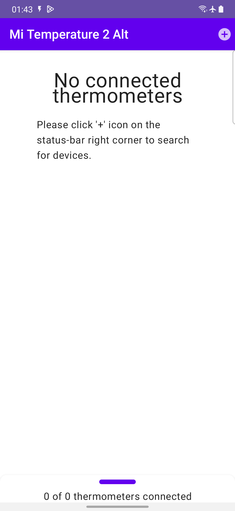
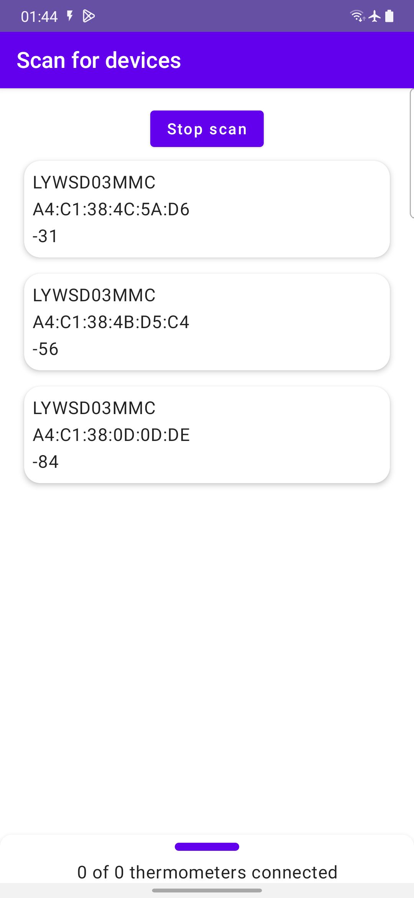
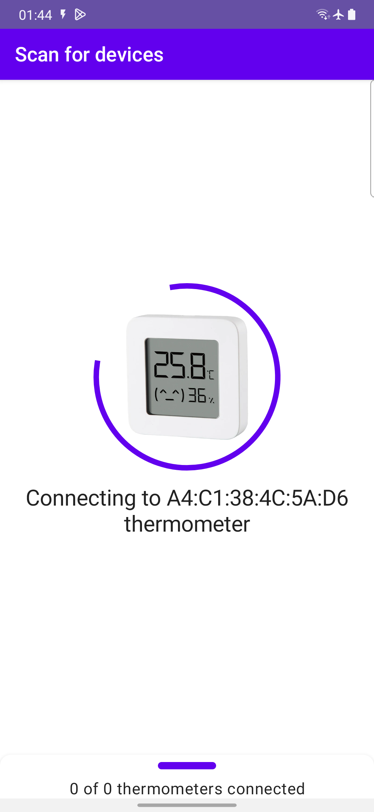
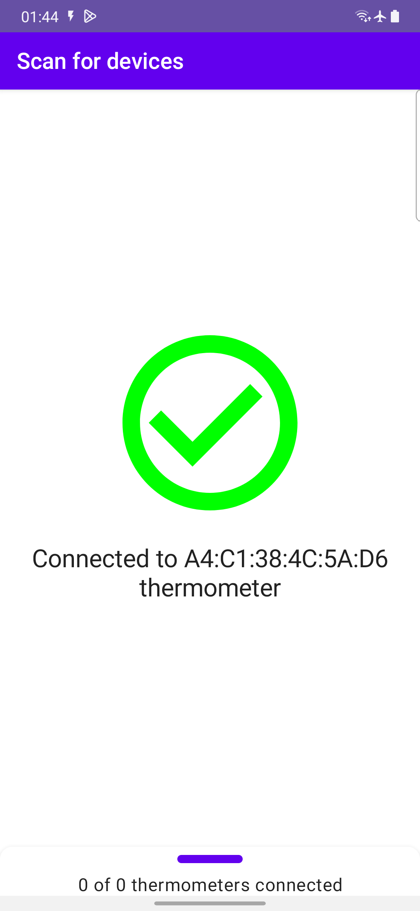
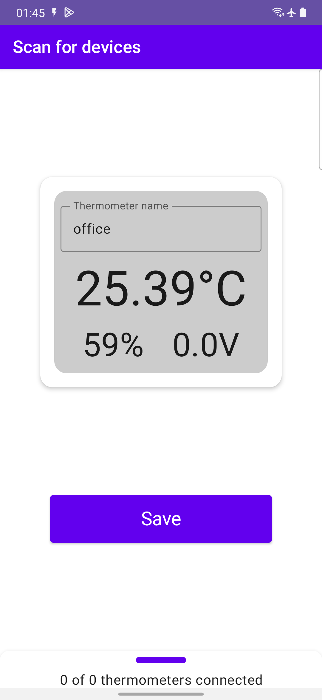
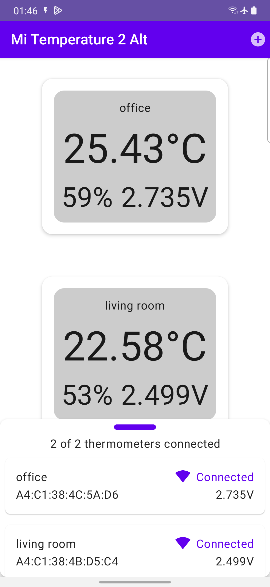
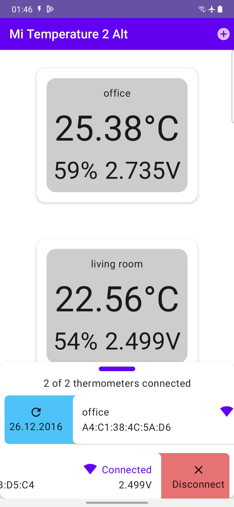
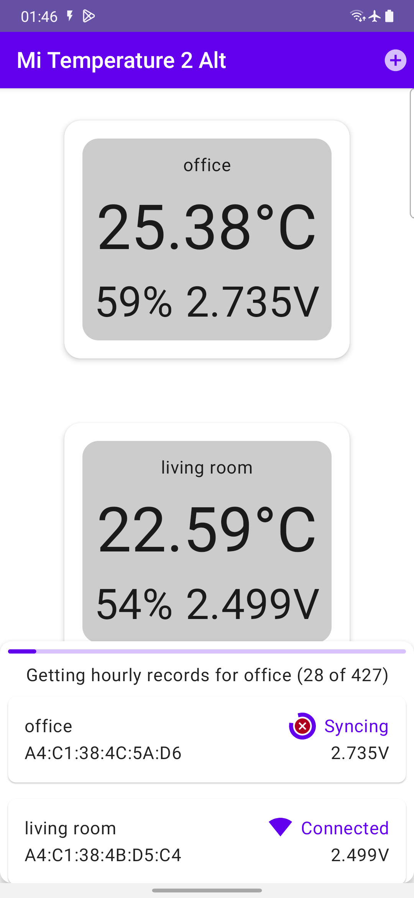
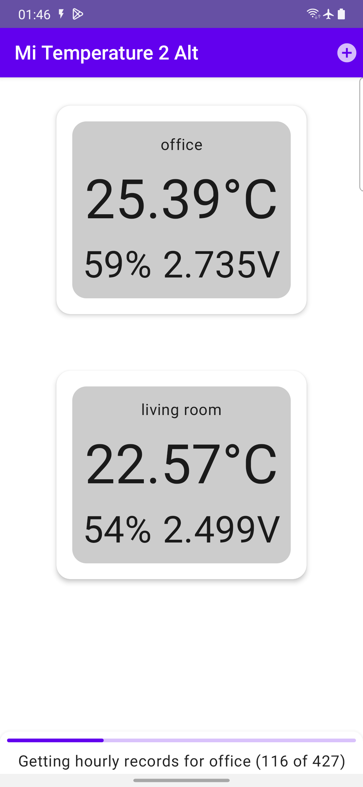

# MiTemperature2Alt
An alternative application for reading data from the Mi Temeprature & Humidity Monitor 2 and its configuration.

 

### Libraries used:
- Jetpack Compose
- Dagger hilt
- [Nordic Kotlin BLE library (scanner and client)](https://github.com/NordicSemiconductor/Kotlin-BLE-Library)

||||
|---|---|---|
||||
||||

### Todo:
- [ ] Saving thermometer and automatic reconnect after application start
- [ ] MVI
- [ ] Getting hourly saved data

### Currently implemented features:
- [x] Scanning for BLE thermometers
- [x] Connecting to BLE thermometer
- [x] Reading current device status (temperature, humidity, voltage)
- [x] Subscribing for current device status updates
- [x] Multi-module project structure